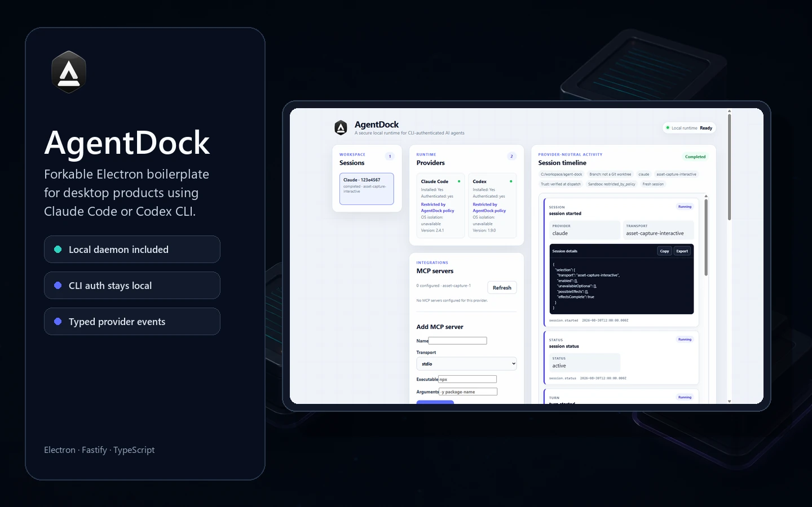
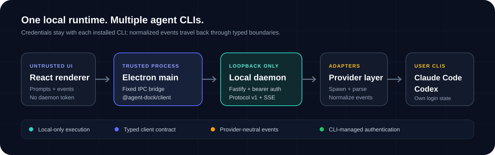

<p align="center"><strong>Open-source Electron and local-daemon boilerplate for desktop apps that use Claude Agent, the legacy Claude CLI, or Codex CLI.</strong></p>

<p align="center">Electron · Fastify · React · TypeScript · Apache-2.0</p>

AgentDock is built for fork-based reuse. Fork the repository, replace the reference workflow and
visual identity, and keep the local runtime pieces your product needs. Users provide credentials
through the Claude Agent SDK, the legacy Claude CLI, or [Codex CLI](https://github.com/openai/codex).
Credentials remain in the user's environment; AgentDock does not collect, store, or proxy provider
API keys.

## What AgentDock is not

AgentDock includes a working reference desktop, but it is not a finished chat product. It has no
accounts, cloud backend, or fixed end-user workflow. Those decisions belong in the product you
build from the boilerplate.

## Build your product with AgentDock

1. Fork the repository and replace the reference UI with your product workflow.
2. Keep daemon access in a trusted process. Never expose the daemon token to a renderer.
3. Add accounts, cloud sync, and product data in your own layer. AgentDock's local session and
   history stores are runtime infrastructure, not a product database.
4. Replace `appId`, `productName`, and the default assets by following
   [the asset guide](docs/assets.md).
5. Run the build, test, and packaging checks, and review the security boundaries before
   distribution.

### Downstream example

Open Vacancy Radar is a downstream product built from AgentDock. It keeps the Electron shell,
local daemon, and connection to Claude Agent, the legacy Claude CLI, or Codex CLI, then adds a
vacancy-focused workflow and its own product behavior.

### Product concept directory

Looking for a focused product wedge? The research-backed
[product concept directory](docs/use-cases/README.md) expands validated workflow families into 45
concrete app concepts, with MVP suggestions, human-approval boundaries, and Epic #4 dependency
tags.

## What the boilerplate provides

- **Provider authentication stays local.** AgentDock never stores or logs credentials. Claude Agent
  SDK mode accepts only a user-provided Anthropic API key or supported Bedrock, Vertex, or Foundry
  configuration; Claude.ai/subscription OAuth is not accepted.
- **One provider-neutral protocol.** Claude and Codex output becomes a typed, ordered event stream.
- **A deliberate trust boundary.** The sandboxed renderer talks only to Electron main over IPC;
  only the trusted main process can reach the authenticated loopback daemon.
- **Windows packaging.** The repository builds an NSIS installer with the daemon and AgentDock's
  default visual identity included.

## Quick start

You need [Node.js 20+](https://nodejs.org/) and pnpm 10 (declared through Corepack):

```bash
corepack enable
pnpm install
pnpm dev:desktop
```

Install and authenticate at least one supported CLI separately:

```bash
# Claude (legacy CLI)
claude auth login
claude auth status

# Codex
codex login
codex login status
```

The desktop starts and owns the local daemon automatically. To run only the daemon:

```bash
pnpm daemon
```

It prints its loopback URL and discovery-file location at startup. See
[the daemon guide](docs/daemon.md) for health checks and lifecycle details.

## Architecture



The renderer never calls the daemon directly. Electron main uses the private workspace package
`@agent-dock/client`, which owns bearer authentication, protocol compatibility, HTTP requests, and
incremental SSE parsing.

```text
React renderer → typed IPC → Electron main → @agent-dock/client → local Fastify daemon
                                                               └→ agent runtime
                                                                  ├→ Claude Agent SDK or legacy Claude CLI
                                                                  └→ Codex adapter  → codex CLI
```

Read [the architecture guide](docs/architecture.md) for component ownership and
[SECURITY.md](SECURITY.md) for the threat model and local-auth mechanism.

### Claude transport modes

Set `AGENT_DOCK_CLAUDE_TRANSPORT` to `auto` (the default), `sdk`, or `cli`. `auto` selects the
Claude Agent SDK only when a user-provided `ANTHROPIC_API_KEY` or exactly one of the supported
Bedrock, Vertex, or Foundry modes is present; it never uses Claude.ai/subscription OAuth or
`CLAUDE_CODE_OAUTH_TOKEN`. `sdk` requires those same conditions and fails closed when they are not
met. `cli` keeps the existing legacy Claude CLI path unchanged. There is no SDK-to-CLI fallback
after SDK work has been accepted.

## Repository map

```text
apps/
  desktop/        Electron + React reference client
  daemon/         Standalone local Fastify service
packages/
  agent-runtime/  Process management, adapters, normalized events
  client/         Typed daemon client for trusted Node/Electron contexts
  shared/         Protocol v1/v2 types and Zod schemas
scripts/assets/   Icon, documentation, and social-image generation tooling
```

## Everyday commands

```bash
pnpm build             # compile every package and application
pnpm typecheck         # strict TypeScript across the workspace
pnpm test              # unit + integration tests; no real provider calls
pnpm lint              # ESLint
pnpm package:win       # Windows NSIS installer
pnpm assets:generate   # regenerate committed app/docs assets
pnpm assets:validate   # validate dimensions, formats, and SVG safety
```

The asset commands require Python 3.11+ and the pinned packages in
[`scripts/assets/requirements.txt`](scripts/assets/requirements.txt). See
[the asset guide](docs/assets.md) before changing the identity or regenerating images.

## Production and packaging

`pnpm build` produces compiled libraries, a self-contained daemon bundle, the Vite renderer, and
bundled Electron main/preload scripts. It does not create an installer.

```bash
pnpm package:win
```

The installer appears in `dist-packages/`:

```text
dist-packages/
  win-unpacked/                    AgentDock.exe + resources/
  AgentDock-Setup-<version>.exe    NSIS installer
```

Windows is the only verified packaging target today. Builds are unsigned, so Windows SmartScreen
may warn on first launch. See [the packaging guide](docs/packaging.md) for the packaged runtime
layout and verification checklist.

## Client SDK

`@agent-dock/client` is currently a private monorepo workspace package, ready to reuse inside a
fork or another trusted Node/Electron package in the same workspace. It is not published to npm.

```ts
import { AgentDockClient } from '@agent-dock/client';

const client = new AgentDockClient({
  baseUrl: 'http://127.0.0.1:PORT',
  token,
});

const session = await client.sessions.create({
  provider: 'claude',
  cwd: '/path/to/project',
  prompt: 'Inspect this repository',
});

for await (const event of client.sessions.events(session.id)) {
  console.log(event);
}
```

Failures are typed (`DaemonUnavailableError`, `UnauthorizedError`,
`ProtocolMismatchError`, `ProviderUnavailableError`, and others), so consumers can branch without
parsing error strings. See [the client guide](docs/client-sdk.md) and
[protocol v1](docs/protocol-v1.md). The additive capability-negotiated contract is documented in
[protocol v2](docs/protocol-v2.md).

## Adding a provider

Adding another CLI means extending the shared provider ID, implementing detection, capabilities,
parsing, and the adapter, passing the shared contract suite, and registering it with the daemon.
The protocol and client remain provider-neutral; the reference desktop needs one selector option.

Follow [the provider guide](docs/providers.md#adding-a-new-provider) for the complete checklist.

## Documentation

- [Development](DEVELOPMENT.md): setup, code map, and architectural rules
- [Architecture](docs/architecture.md): runtime flow, responsibilities, and trust boundaries
- [Product concepts](docs/use-cases/README.md): researched app directory, MVP wedges, and roadmap dependencies
- [Security](SECURITY.md): threat model, loopback auth, and process hygiene
- [Protocol v1](docs/protocol-v1.md): normalized events and wire guarantees
- [Protocol v2](docs/protocol-v2.md): capability negotiation, correlated content, and versioned routes
- [Client SDK](docs/client-sdk.md): full client API and errors
- [Providers](docs/providers.md): adapters, detection, parsers, and contract tests
- [Daemon](docs/daemon.md): standalone operation, routes, and lifecycle
- [Electron](docs/electron.md): renderer/main/daemon boundary
- [Packaging](docs/packaging.md): electron-builder and NSIS details
- [Assets](docs/assets.md): brand sources, generated files, and replacement guide
- [Troubleshooting](docs/troubleshooting.md): common failures and diagnostics
- [Contributing](CONTRIBUTING.md): workflow and pull-request checklist

## License

[Apache-2.0](LICENSE)
